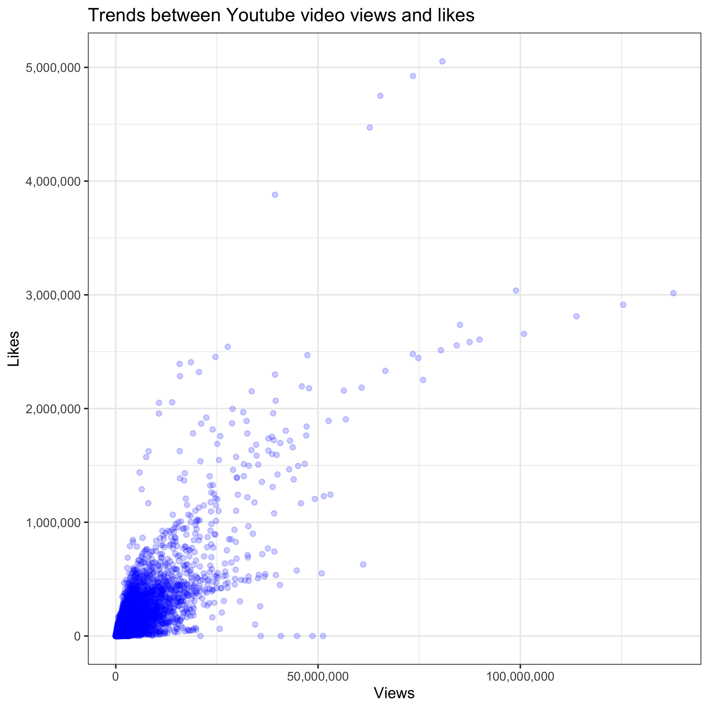
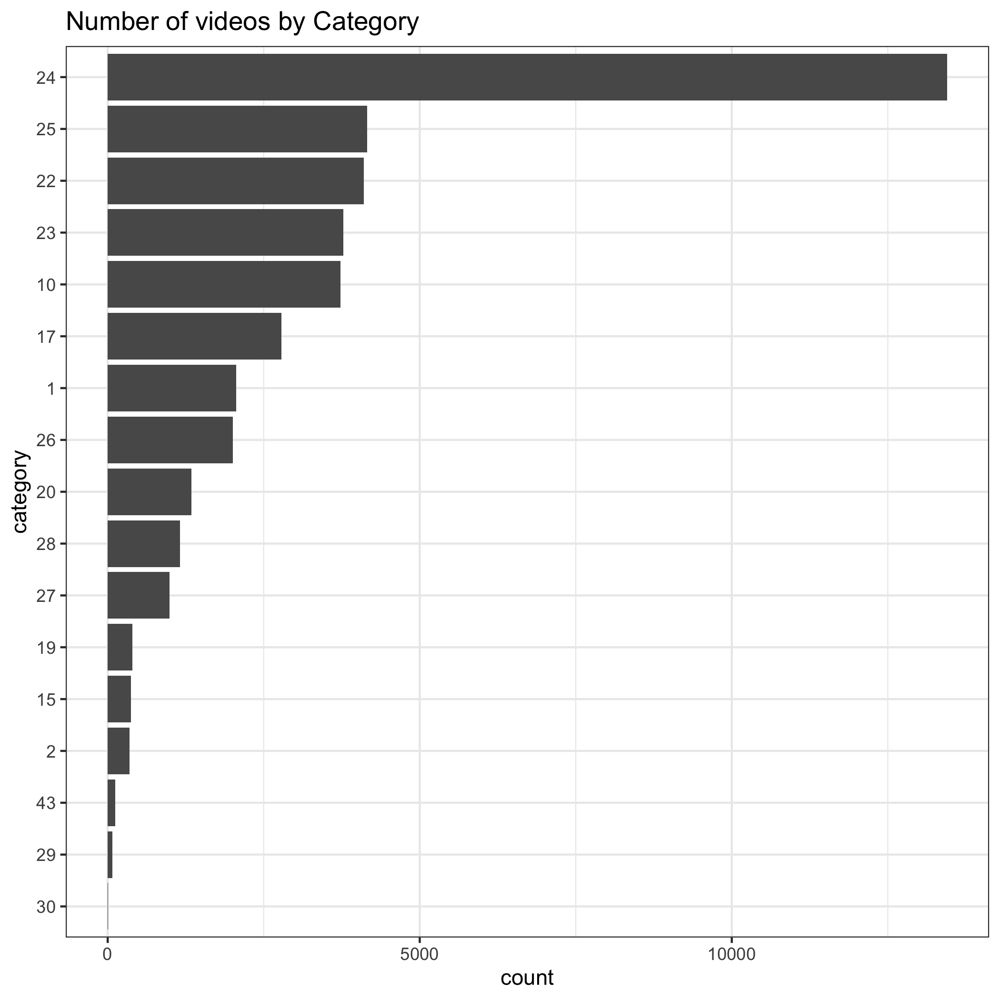
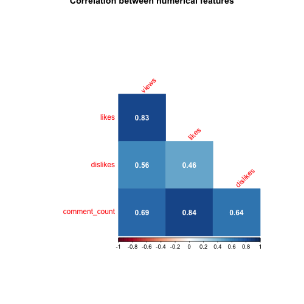
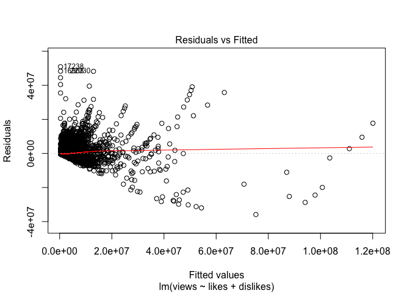
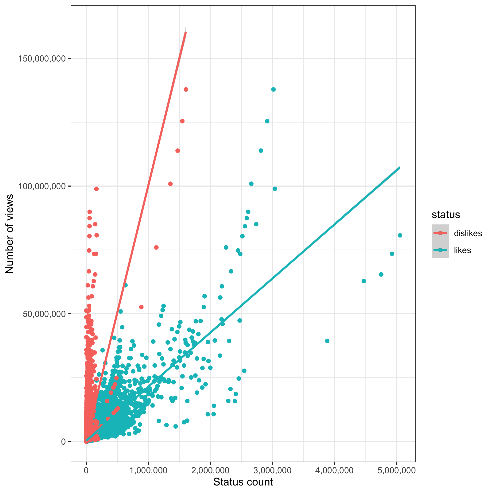
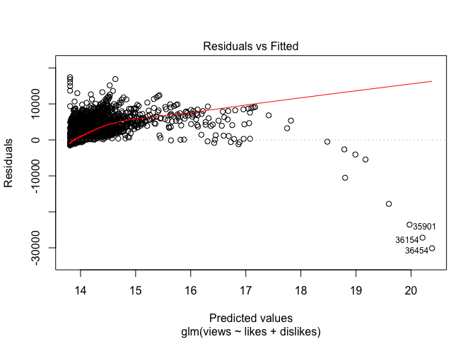
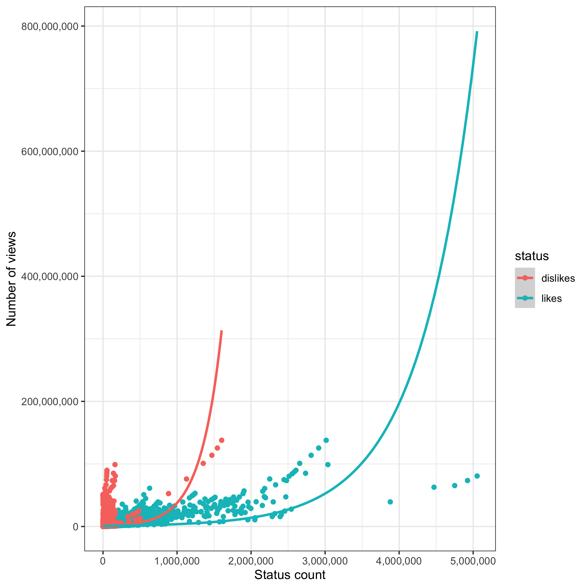

# Introduction
This report investigates `Trending YouTube Video Statistics’, which was has records from 2008 and was last updated on 2019-06-02. The primary aim of the dataset is for use in determining the year’s top trending Youtube videos.  Whilst it includes data specific to 10 different countries, we have chosen to explore the dataset for Canada only.

The dataset contains rows of trending videos which include features like category, trending date, tags, number of views, likes, dislikes, shares and descriptions of videos. Previous research has found that despite the large number of channels on Youtube, on average 85% of all views go to just 3% of channels (Bärtl 2018). We will explore this dataset further by investigating **the relationship between video category, number of views it recieves, likes/dislikes and comment count?** Specificially, we aim to investigate **whether the number of views on Youtube videos correlate with the number of likes or dislikes on a video.**

# About data


Below are the number of rows and columns for the dataset.

```r
nrow(CAN) 
```

```
## [1] 40881
```

```r
ncol(CAN)
```

```
## [1] 16
```

The following are data types of the columns in the dataset.


```r
features <- CAN %>% colnames() %>% tibble()
types <- CAN %>% sapply(class) %>% tibble()
feature_type <- cbind(features,types)
colnames(feature_type)<-c("Features","Type")
kable(feature_type) %>%  kableExtra::kable_styling(full_width = F)
```

<table class="table" style="width: auto !important; margin-left: auto; margin-right: auto;">
 <thead>
  <tr>
   <th style="text-align:left;"> Features </th>
   <th style="text-align:left;"> Type </th>
  </tr>
 </thead>
<tbody>
  <tr>
   <td style="text-align:left;"> video_id </td>
   <td style="text-align:left;"> character </td>
  </tr>
  <tr>
   <td style="text-align:left;"> trending_date </td>
   <td style="text-align:left;"> Date </td>
  </tr>
  <tr>
   <td style="text-align:left;"> title </td>
   <td style="text-align:left;"> character </td>
  </tr>
  <tr>
   <td style="text-align:left;"> channel_title </td>
   <td style="text-align:left;"> character </td>
  </tr>
  <tr>
   <td style="text-align:left;"> category_id </td>
   <td style="text-align:left;"> numeric </td>
  </tr>
  <tr>
   <td style="text-align:left;"> publish_time </td>
   <td style="text-align:left;"> logical </td>
  </tr>
  <tr>
   <td style="text-align:left;"> tags </td>
   <td style="text-align:left;"> character </td>
  </tr>
  <tr>
   <td style="text-align:left;"> views </td>
   <td style="text-align:left;"> numeric </td>
  </tr>
  <tr>
   <td style="text-align:left;"> likes </td>
   <td style="text-align:left;"> numeric </td>
  </tr>
  <tr>
   <td style="text-align:left;"> dislikes </td>
   <td style="text-align:left;"> numeric </td>
  </tr>
  <tr>
   <td style="text-align:left;"> comment_count </td>
   <td style="text-align:left;"> numeric </td>
  </tr>
  <tr>
   <td style="text-align:left;"> thumbnail_link </td>
   <td style="text-align:left;"> character </td>
  </tr>
  <tr>
   <td style="text-align:left;"> comments_disabled </td>
   <td style="text-align:left;"> logical </td>
  </tr>
  <tr>
   <td style="text-align:left;"> ratings_disabled </td>
   <td style="text-align:left;"> logical </td>
  </tr>
  <tr>
   <td style="text-align:left;"> video_error_or_removed </td>
   <td style="text-align:left;"> logical </td>
  </tr>
  <tr>
   <td style="text-align:left;"> description </td>
   <td style="text-align:left;"> character </td>
  </tr>
</tbody>
</table>

# EDA

## Trend in views and likes
Below we plot number of likes as a function of views.



We see that in general the number of likes increase as we have more views. The points are concentrated at the bottom left corner (there are more videos with number of views less than 50 million, and likes less than 1 million). 

## Number of videos in each category.
We explore how many videos are in each category.


The category corresponding to its ID can be found [here]( https://developers.google.com/youtube/v3/docs/videoCategories/list ). 

Top 5 Categories are:

- Category 24: Entertainment
- Category 25: News and Politics
- Category 22: People and Blogs
- Category 23: Comedy
- Category 10: Music

Bottom 5 Categories are:

- Category 30: Movies
- Category 29: Nonprofits & Activism
- Category 43: Shows
- Category 2: Autos and Vehicles
- Category 15: Pets and Animals


## Correlation plot

Next, we explore correlation between numerical columns.



We note the highest correlation between the number of likes and number of comments, and the lowest correlation beetween number of views and number of dislikes. 


# Analysis methods

We explore the relationship between the number of views and number of likes and dislikes. We aim to build a regression model of `views` as a function of `likes` and `dislikes`. It is reasonable to assume that the dependent variable is `views` and the explanatory variables are `likes` and `dislikes`. One could switch these response and explanatory variables depending on their interpretation.

We use linear regression to fit the model.  


```r
fit.lm <- readRDS(file="../rds/lm.rds")
```

We also use poisson regression method. We choose this method because the response variable `views` is actually a count data, and may follow Poisson distribution.


```r
fit.glm <-readRDS(file="../rds/glm.rds")
```

# Results

We check the summary of the linear model. `r.squared` denotes the goodness of fit of the data, measured by the ratio between the variance of the fitted values and variance of the actual values (response variable = `views`). We see that it is close to 0, which means the data is poorly fitted.

```r
glance(fit.lm)
```

```
## # A tibble: 1 x 11
##   r.squared adj.r.squared  sigma statistic p.value    df  logLik    AIC    BIC
##       <dbl>         <dbl>  <dbl>     <dbl>   <dbl> <int>   <dbl>  <dbl>  <dbl>
## 1     0.726         0.726 1.77e6    54283.       0     3 -6.46e5 1.29e6 1.29e6
## # … with 2 more variables: deviance <dbl>, df.residual <int>
```


Below is the diagnostic plot of the linear model, showing residual vs. fitted values. We see that the fitted values are aggressively clustered at lower end with low residual. We have a number of outliers.

```r
plot(fit.lm,which=1)
```

<!-- -->

Here is a plot that performs linear regression on views with one explanotory variable each, `likes` and `dislikes`.


Although we see a poor fit, we see that it does capture the trend that as number of likes or dislikes increase, the views also increase.

Next we present the residuals vs fitted plot from poisson regression. We see that the residuals do not exceed 1e+7 like in the linear regression, but we still see skewed distribution of the points. As the value of fitted values (`views`) increase, the more deviation we have from the actual value. This suggests that neither linear or poisson regression does well in modelling `views` at higher values.


```r
plot(fit.glm,which=1)
```

<!-- -->

Here is a plot that performs poisson regression on views with `likes` and `dislikes`. The model exhibits an exponential behaviour. It fits reasonably well for the lower values for the response variable but quickly overshoots.


We compute the sum of the squared residuals of both models and observe that poisson regression yields a smaller number. One reason might be that the sum of the residuals from the outliers in poisson regression does not outweigh the total sum of residuals in linear regression.

```r
sum(resid(fit.lm)^2)
```

```
## [1] 1.285747e+17
```

```r
sum(resid(fit.glm)^2)
```

```
## [1] 78292616784
```


# Discussion/Conclusion

We have explored the YouTube dataset from Kaggle in this report by a scatter plot, bar graph and a correlation plot to observe trends in the data. Then we performed regression analysis on `views` which we assumed is a function of `likes` and `dislikes`. We encountered difficulty in fitting the model with both linear and poisson regression, due to the outliers. One way to deal with this is to create a weight vector such that the outliers carry little weights. This may be studied for our future work.

# References

Bärtl, M. (2018). YouTube channels, uploads and views: A statistical analysis of the past 10 years. Convergence, 24(1), 16–32. https://doi.org/10.1177/1354856517736979

